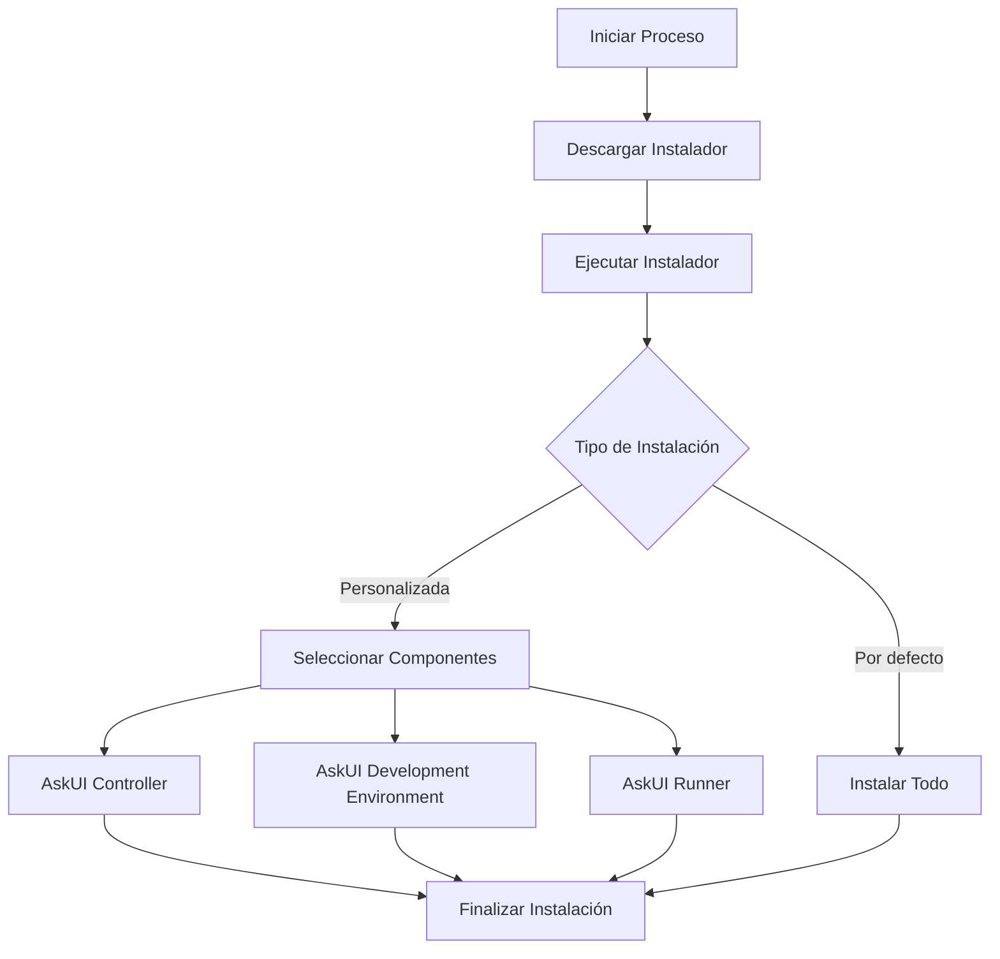

# 🚀 Guía de Instalación y Configuración de AskUI

<div align="center">
  


*Una guía paso a paso para instalar, configurar y crear tu primer proyecto de automatización UI*

</div>

## 📋 Tabla de Contenidos

- [Introducción](#introducción)
- [Requisitos Previos](#requisitos-previos)
- [Proceso de Instalación](#proceso-de-instalación)
- [Configuración del Entorno](#configuración-del-entorno)
- [Tu Primer Proyecto](#tu-primer-proyecto)
- [Workflow de Ejemplo](#workflow-de-ejemplo)
- [Herramientas Recomendadas](#herramientas-recomendadas)
- [Recursos Adicionales](#recursos-adicionales)
- [Solución de Problemas](#solución-de-problemas)

## 🌟 Introducción

AskUI es una poderosa herramienta que te permite automatizar interacciones con interfaces de usuario, simulando acciones humanas como clics, escritura y navegación. Esta guía te llevará paso a paso por el proceso completo, desde la preparación hasta la creación de tu primer flujo de trabajo automatizado.

### ¿Qué puedes hacer con AskUI?

- ✅ Automatizar tareas repetitivas en aplicaciones de escritorio
- ✅ Crear pruebas de interfaz de usuario robustas
- ✅ Simular interacciones humanas con sitios web
- ✅ Construir flujos de trabajo complejos entre múltiples aplicaciones

## 📝 Requisitos Previos

Antes de comenzar la instalación, asegúrate de cumplir con todos los requisitos necesarios.

### Checklist de Preparación

<table>
<tr>
<td>

### 🔍 Lista de Verificación

- [ ] Obtener una cuenta AskUI (ID de workspace y token)
- [ ] Verificar permisos de administrador en Windows
- [ ] Configurar política de ejecución de PowerShell
- [ ] Instalar Visual Studio Code (recomendado)

</td>
<td>

### 🛠️ Herramientas Necesarias

- Windows 10/11
- PowerShell
- Conexión a Internet
- Permisos de administrador

</td>
</tr>
</table>

### 1. Obtener una Cuenta AskUI

Para comenzar, necesitas obtener credenciales de AskUI:

1. Visita [askui.com](https://askui.com) y completa el formulario de registro
2. Espera confirmación de un representante de AskUI que te proporcionará:
   - ID de Workspace
   - Token de Acceso
3. Guarda estas credenciales de forma segura

> ⚠️ **Nota**: El proceso de creación de cuenta puede tomar tiempo ya que requiere verificación humana.

### 2. Verificar Permisos de Administrador

AskUI necesita permisos de administrador para funcionar correctamente.

**Método 1**: En Windows 11
1. Ve a Configuración del Sistema → Cuentas
2. Verifica si aparece "Administrador" bajo tu nombre de usuario

**Método 2**: Para cualquier versión de Windows
1. Intenta abrir PowerShell como administrador
2. Si puedes ejecutar PowerShell con privilegios elevados, tienes los permisos necesarios

> 💡 **Consejo**: Si tu dispositivo es administrado por el departamento de TI de tu empresa, deberás solicitar permisos de administrador.

### 3. Configurar Política de Ejecución de PowerShell

PowerShell debe estar configurado para permitir la ejecución de scripts.

```powershell
# Verificar configuración actual
Get-ExecutionPolicy -List

# Actualizar si es necesario
Set-ExecutionPolicy -ExecutionPolicy Unrestricted -Scope LocalMachine

# Verificar nuevamente para confirmar
Get-ExecutionPolicy -List
```

### 4. Instalar Visual Studio Code

Aunque no es obligatorio, VS Code mejora significativamente la experiencia de desarrollo con AskUI.

1. Visita [code.visualstudio.com](https://code.visualstudio.com/)
2. Descarga e instala VS Code
3. Sigue el proceso de instalación estándar

## 🔧 Proceso de Instalación

El proceso de instalación consta de varios pasos, desde la descarga hasta la selección de componentes.

### Diagrama de Flujo de Instalación



### 1. Descargar el Instalador

1. Visita la [documentación oficial de AskUI](https://docs.askui.com)
2. Selecciona "Get Started" en la sección de Windows
3. Sigue el enlace de descarga para el instalador de Windows

### 2. Ejecutar el Instalador

Cuando ejecutes el instalador, es posible que recibas una advertencia de seguridad:

1. Haz clic en "Más información" cuando aparezca la advertencia
2. Selecciona "Ejecutar de todos modos" para continuar
3. Sigue las instrucciones en pantalla

> ⚠️ **Nota**: Esta advertencia es normal ya que el instalador aún no está firmado digitalmente en el ecosistema de Windows.

### 3. Selección de Componentes

Durante la instalación, puedes elegir componentes específicos:

<table>
<tr>
<th>Componente</th>
<th>Descripción</th>
<th>Recomendación</th>
</tr>
<tr>
<td>AskUI Controller</td>
<td>Controla tu máquina y captura pantallas para detección de elementos</td>
<td>✅ Requerido</td>
</tr>
<tr>
<td>AskUI Development Environment (ADE)</td>
<td>Entorno para PowerShell que gestiona el controlador y Node.js</td>
<td>✅ Recomendado para desarrolladores</td>
</tr>
<tr>
<td>AskUI Runner</td>
<td>Necesario para ejecutar flujos de trabajo desde AskUI Studio</td>
<td>⚠️ Opcional</td>
</tr>
</table>

Para entornos empresariales con proxies o dispositivos administrados, consulta la lista de verificación para empresas en la documentación.

## ⚙️ Configuración del Entorno

Después de la instalación, debes configurar correctamente el entorno AskUI.

### 1. Iniciar el Shell de AskUI

El AskUI Development Environment (ADE) proporciona un entorno PowerShell especializado:

```powershell
# Abrir PowerShell como administrador
# Ejecutar:
AskUI shell
```

El prompt cambiará para indicar que estás en el entorno shell de AskUI.

### 2. Configurar tus Credenciales

```powershell
# Navegar a tu directorio home
cd ~

# Configurar credenciales
AskUI settings -workspaceId "tu-workspace-id" -token "tu-access-token"

# Verificar configuración
AskUI-ShowSettings
```

### 3. Iniciar el Controlador AskUI

Hay dos métodos para iniciar el controlador:

**Modo Primer Plano**:
```powershell
AskUI-StartController
```
Muestra logs directamente en la ventana de PowerShell.

**Modo Segundo Plano**:
```powershell
AskUI-StartController -RunInBackground
```
Inicia el controlador como servicio en segundo plano.

> 💡 **Consejo**: El modo segundo plano te permite seguir usando la misma ventana PowerShell.

## 📁 Tu Primer Proyecto

Con el entorno configurado, puedes crear tu primer proyecto AskUI.

### 1. Inicializar un Proyecto

```powershell
# Desde el shell AskUI, en el directorio deseado:
AskUI-NewProject -ProjectName Goose -TestFramework jest -TypeScriptConfig true

# Cuando se te pregunte si deseas guardar el directorio en la ruta actual:
# Escribe 'y' y presiona Enter

# Abrir en VS Code:
code .
```

Cuando VS Code se abra, selecciona "Sí, confío en los autores" para habilitar todas las funciones.

### 2. Estructura del Proyecto

```
tu-proyecto-askui/
├── .askui/
│   └── settings/
│       └── askui-environment-settings.json  # Configuración y credenciales
├── askui-example/
│   └── askui-helper.ts                      # Opciones y reportes
├── jest.config.ts                          # Configuración de Jest
└── my-first-askui-testsuit.test.ts         # Ejemplo de workflow
```

### 3. Ejecutar Anotaciones

Las anotaciones te ayudan a visualizar los elementos detectados en tu pantalla:

1. Abre la terminal integrada en VS Code con `Alt+U`
2. Activa el shell AskUI con `AskUI-Shell`
3. Ejecuta el proyecto con `AskUI-RunProject`


*Ejemplo de cómo se ven las anotaciones: elementos detectados marcados con cajas rojas*

## 🔄 Workflow de Ejemplo

Veamos cómo crear un flujo de trabajo simple que interactúa con una página web.

### Ejemplo con Página de Práctica

1. Abre la página de práctica AskUI: [askui.github.io/askui-practice-page](https://askui.github.io/askui-practice-page)
2. Esta página contiene diversos elementos UI para experimentación

### Paso a Paso: Crear un Workflow Básico

1. **Ejecutar una anotación para ver qué elementos detecta AskUI**

```typescript
it('should annotate practice page', async () => {
  await aui.annotateInteractively().exec();
});
```

2. **Deshabilitar la anotación y crear una interacción**

```typescript
// Deshabilitar anotación
xit('should annotate practice page', async () => {
  await aui.annotateInteractively().exec();
});

// Habilitar interacción
it('should click button 2', async () => {
  await aui.click().button().withText('2').exec();
});
```

3. **Ejecutar el workflow**

```powershell
AskUI run project
```

Inmediatamente después, cambia a la página de práctica - verás cómo el cursor se mueve y hace clic en el botón "2".

### Workflow Extendido

Aquí hay un ejemplo más completo que muestra varias interacciones:

```typescript
describe('Practice Page Workflow', () => {
  it('should interact with multiple elements', async () => {
    // Click en el botón 2
    await aui.click().button().withText('2').exec();
    
    // Escribir en un campo de texto
    await aui.type('Hello AskUI').textfield().exec();
    
    // Seleccionar un elemento del menú desplegable
    await aui.click().dropdown().exec();
    await aui.click().text('Option 2').exec();
    
    // Arrastrar y soltar
    await aui.dragAndDrop()
      .element().withText('Drag me')
      .target().element().withText('Drop here')
      .exec();
  });
});
```

## 🧰 Herramientas Recomendadas

Para mejorar tu experiencia de desarrollo con AskUI, considera estas extensiones para VS Code:

<table>
<tr>
<th>Extensión</th>
<th>Beneficio</th>
<th>Instalación</th>
</tr>
<tr>
<td>ASLint</td>
<td>Validación de sintaxis para instrucciones AskUI</td>
<td>

```
Ctrl+P → ext install aslint
```
</td>
</tr>
<tr>
<td>LivePreview</td>
<td>Vista de navegador integrada dentro de VS Code</td>
<td>

```
Ctrl+P → ext install livepreview
```
</td>
</tr>
<tr>
<td>Jest Runner</td>
<td>Ejecuta bloques de prueba individuales desde archivos de código</td>
<td>

```
Ctrl+P → ext install jest-runner
```
</td>
</tr>
</table>

## 📚 Recursos Adicionales

Para continuar tu aprendizaje con AskUI, explora estos recursos:

- [Documentación API de AskUI](https://docs.askui.com/api) - Referencia detallada de comandos
- [Página de Onboarding](https://docs.askui.com/onboarding) - Experiencias guiadas de aprendizaje
- [Comunidad AskUI](https://community.askui.com) - Soporte y foros comunitarios

## 🔍 Solución de Problemas

<details>
<summary><b>El controlador no inicia correctamente</b></summary>

1. Verifica que tengas permisos de administrador
2. Asegúrate de que la política de ejecución de PowerShell está configurada correctamente
3. Comprueba que tus credenciales están correctamente configuradas con `AskUI show settings`
4. Reinicia tu sistema y vuelve a intentarlo

</details>

<details>
<summary><b>No se detectan elementos en la pantalla</b></summary>

1. Asegúrate de que el controlador AskUI está en ejecución
2. Verifica que no hay superposiciones o ventanas que bloqueen la vista
3. Intenta con selectores más generales (por ejemplo, cualquier botón en lugar de un botón específico)
4. Ejecuta una anotación para ver qué elementos se están detectando realmente

</details>

<details>
<summary><b>Error al ejecutar el proyecto</b></summary>

1. Verifica la sintaxis de tus comandos AskUI
2. Asegúrate de que Node.js está instalado correctamente
3. Comprueba que Jest está configurado adecuadamente
4. Revisa los logs para mensajes de error específicos

</details>

---

<div align="center">

## 🎯 Checklist Final

- [ ] Cuenta AskUI obtenida
- [ ] Permisos de administrador verificados
- [ ] PowerShell configurado correctamente
- [ ] AskUI instalado completamente
- [ ] Credenciales configuradas
- [ ] Controlador iniciado correctamente
- [ ] Proyecto creado y ejecutado
- [ ] Extensiones VS Code instaladas

</div>

---

<div align="center">
  
*Esta guía fue creada con ❤️ para hacer tu experiencia con AskUI más sencilla y productiva.*

</div>
