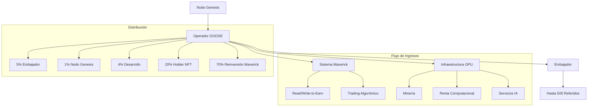
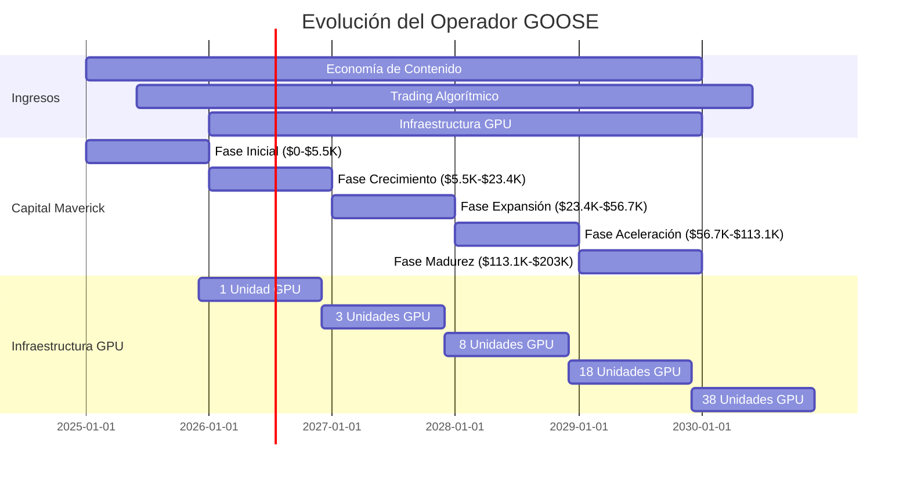
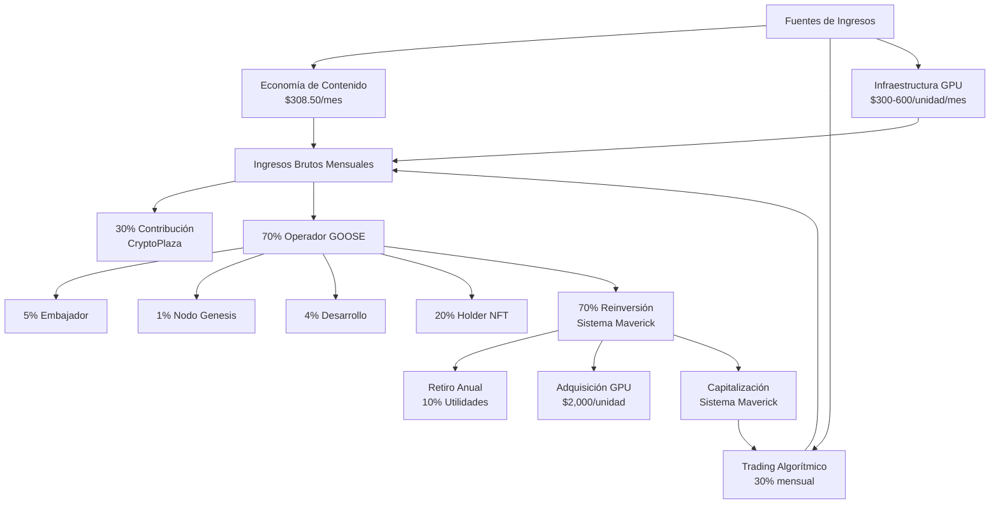
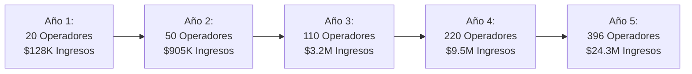
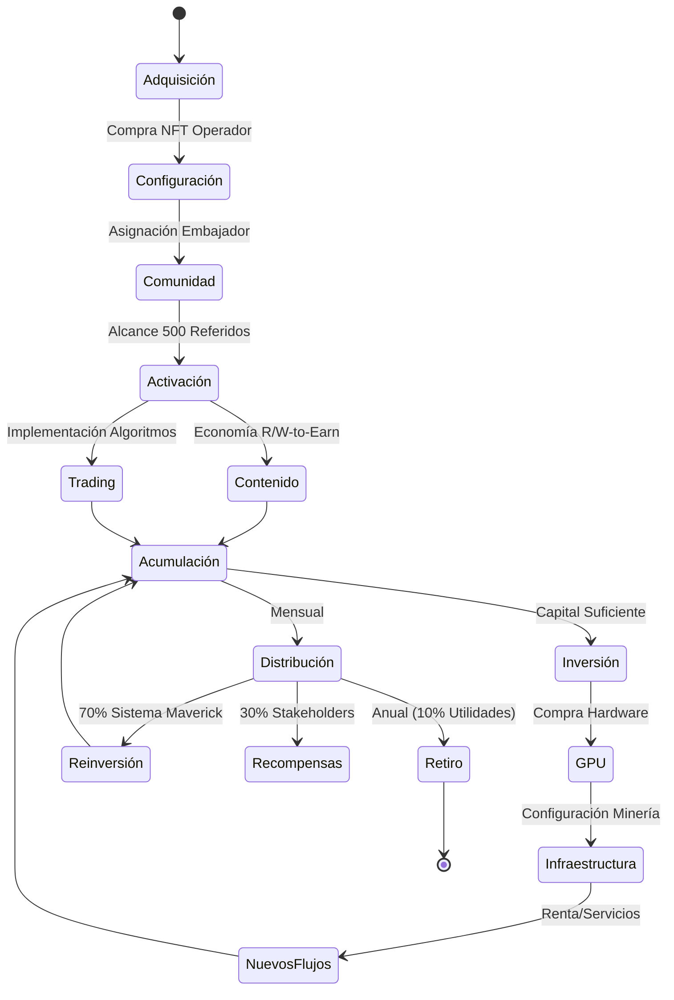
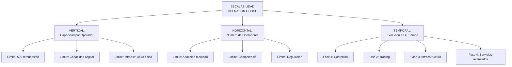

# Operador GOOSE: Flujo de Trabajo y Visualización de Fases

## 1. ARQUITECTURA DEL SISTEMA



## 2. FASES DE DESARROLLO DEL OPERADOR GOOSE



## 3. FLUJO ECONÓMICO DEL OPERADOR GOOSE



## 4. PROYECCIÓN DE CRECIMIENTO (5 AÑOS)

### 4.1 Evolución Financiera por Operador

| Categoría | Año 1 | Año 2 | Año 3 | Año 4 | Año 5 |
|-----------|-------|-------|-------|-------|-------|
| Ingresos Totales | $6,402 | $18,102 | $28,902 | $43,302 | $61,302 |
| Capital Maverick | $5,500 | $23,420 | $56,730 | $113,160 | $203,000 |
| Unidades GPU | 1 | 3 | 8 | 18 | 38 |
| Retiro (10%) | $512 | $1,539 | $2,457 | $3,681 | $5,211 |

### 4.2 Escalabilidad del Ecosistema



## 5. CICLO OPERATIVO DEL OPERADOR GOOSE



## 6. PANORAMA DE ESCALABILIDAD MULTIDIMENSIONAL

La escalabilidad del modelo Operador GOOSE opera en tres dimensiones interrelacionadas:

### 6.1 Dimensiones de Crecimiento



### 6.2 Puntos Críticos de Crecimiento

La evolución de un Operador GOOSE atraviesa puntos críticos que determinan su capacidad de generar ingresos exponencialmente:

1. **Punto Crítico A**: Alcanzar 500 referidos activos (Economía de Contenido)
2. **Punto Crítico B**: Acumular $5,500 en Sistema Maverick (Inicio Trading)
3. **Punto Crítico C**: Adquirir primera unidad GPU (Inicio Infraestructura)
4. **Punto Crítico D**: Superar 10 unidades GPU (Economías de escala)
5. **Punto Crítico E**: Alcanzar $100K+ capital (Autofinanciamiento sostenible)

## 7. MODELO DE MADURACIÓN OPERATIVA

```mermaid
quadrantChart
    title Evolución del Operador GOOSE en el Tiempo
    x-axis Capital Acumulado
    y-axis Ingresos Mensuales
    quadrant-1 "Alta Rentabilidad, Bajo Capital"
    quadrant-2 "Alta Rentabilidad, Alto Capital"
    quadrant-3 "Baja Rentabilidad, Bajo Capital"
    quadrant-4 "Baja Rentabilidad, Alto Capital"
    Año 1: [0.03, 0.05]
    Año 2: [0.12, 0.15]
    Año 3: [0.28, 0.24]
    Año 4: [0.56, 0.36]
    Año 5: [1.0, 0.51]
```

## 8. RECOMENDACIONES DE IMPLEMENTACIÓN

1. **Fase 1 (Año 1)**
   - Priorizar crecimiento de comunidad hasta 500 referidos
   - Implementar estrategias de participación en contenido (R/W-to-Earn)
   - Comenzar operaciones de trading en segundo semestre
   - Adquirir primera unidad GPU al finalizar el año

2. **Fase 2 (Año 2)**
   - Optimizar parámetros de trading para maximizar rendimiento
   - Expandir infraestructura GPU (3 unidades)
   - Desarrollar primeros servicios de renta computacional
   - Establecer sistema de analítica para optimización continua

3. **Fase 3-5 (Años 3-5)**
   - Implementar estrategia de reinversión agresiva
   - Desarrollar servicios de valor añadido en infraestructura
   - Implementar automatizaciones para gestión de comunidad
   - Diversificar estrategias de trading según condiciones de mercado

---

*Este documento proporciona una visualización simplificada del modelo del Operador GOOSE basado en el análisis financiero y proyecciones proporcionadas en el documento original.*
